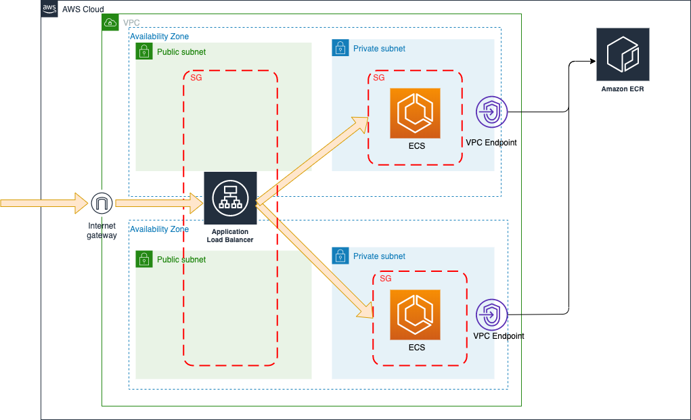

# pub_ecs_laravel_infra

## 構成図



## 起動

```bash
$ cd envs/dev/ 
$ touch terraform.tfvars
```

terraform.tfvarsを編集

```
# ALBにアクセスするIPを記載
allow_cidr_block = "XXX.XXX.XXX.XXX/32"
```


```bash
$ terraform init

# fishだとうまく行かないのでbashにして実行(あとで.shにする)
$ terraform apply \
-var=database_name=`aws ssm get-parameters --name "/dev/db/database_name" --region=us-east-1 --with-decryption | jq  -r ".Parameters[].Value"` \
-var=db_master_username=`aws ssm get-parameters --name "/dev/db/username" --region=us-east-1 --with-decryption | jq  -r ".Parameters[].Value"` \
-var=db_master_password=`aws ssm get-parameters --name "/dev/db/password" --region=us-east-1 --with-decryption | jq  -r ".Parameters[].Value"` \
--parallelism=30
```

ECRには手動でdocker imageをpushしておく

```Dockerfile
FROM httpd:2.4
```

ALBのDNS名にブラウザからアクセスすると`It works!`が表示されることを確認

## RDSの機密情報
system managerに手動で作成

## ECS Exec

```bash
$ aws ecs execute-command --cluster ecs_laravel_pj_dev-ecs \
  --task [タスクID] \
  --container app \
  --interactive \
  --command "/bin/bash" \
  --region=us-east-1
```
